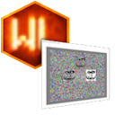

<div align="center">




[](https://creativecommons.org/licenses/by-sa/4.0/)

## Информация

</div>

``WoowzLib.Window`` — Создание WinAPI окон, и создание для них элементов

### Детали
* Нужен [WoowzLib](https://github.com/Woowz11/WoowzLib/tree/main/WoowzLib.Core)

### Ссылки
[NuGet](https://www.nuget.org/packages/Woowz11.WoowzLib.Window) • [GitHub](https://github.com/Woowz11/WoowzLib/tree/main/WoowzLib.Window)

<div align="center">

## Под-Модули

|Название |Информация |
|:--------|:----------|
|Window   | Функции для окон |

## Больше информации

### Window
</div>
<details><summary>Смотреть...</summary>

Пример создания окна:

```csharp
public static int Main(string[] Args){
	try{
		WL.WoowzLib.Start();
		
		Window W = new Window();
		W.BackgroundColor = ColorB.Blue;
		
		double D = 2;
		while(W.Alive){
			WL.System.Tick.LimitFPS(1, 120, TD => {
				D += TD.DeltaTimeS;
				if(D > 0.5f){ W.Title = "Пример окна | FPS: " + TD.FPS; D = 0; }
				
				W.Render();
			});
		
			WL.WoowzLib.Update();
		}
		
	}catch(Exception e){
		Logger.Fatal("Произошла фатальная ошибка внутри самого приложения!", e);
		return 1;
	}
	
	return 0;
}
```

Пример создания двух окон:

```csharp
public static int Main(string[] Args){
	try{
		WL.WoowzLib.Start();
	
		Window W1 = new Window();
		W1.BackgroundColor = ColorB.Blue;

		Window W2 = new Window();
		W2.BackgroundColor = ColorB.Red;
		
		double D = 2;
		while(W1.Alive || W2.Alive){
			WL.System.Tick.LimitFPS(1, 120, TD => {
				if(W1.Alive){
					D += TD.DeltaTimeS;
					if(D > 0.5f){ W1.Title = "Пример окна | FPS: " + TD.FPS; D = 0; }
			
					W1.Render();
				}

				if(W2.Alive){
					W2.Title = "Второе окно | " + WL.Math.Random.Fast_0_1();

					W2.Render();
				}
			});
	
			WL.WoowzLib.Update();
		}
	
	}catch(Exception e){
		Logger.Fatal("Произошла фатальная ошибка внутри самого приложения!", e);
		return 1;
	}

	return 0;
}
```

Пример разноцветного окна:

```csharp
public static int Main(string[] Args){
	try{
		WL.WoowzLib.Start();
	
		Window W = new Window(Title: "Эпилепсия... 😁");

		W.OnClose += _ => {
			Logger.Info("Окно закрывается!");
		};
		
		while(W.Alive){
			WL.System.Tick.LimitFPS(1, 120, TD => {
				W.RenderMessage(W.CursorPosition + " | " + W.CursorInside, new ColorB(
					(byte)(WL.Math.DSin((float)TD.DeltaTick * 1) * 255),
					(byte)(WL.Math.DSin((float)TD.DeltaTick * 2) * 255),
					(byte)(WL.Math.DSin((float)TD.DeltaTick * 3) * 255)
				));
			});
	
			WL.WoowzLib.Update();
		}
	
	}catch(Exception e){
		Logger.Fatal("Произошла фатальная ошибка внутри самого приложения!", e);
		return 1;
	}

	return 0;
}
```

Пример окна с панелями (элементами):

```csharp
public static int Main(string[] Args){
	try{
		WL.WoowzLib.Start();
	
		Window W = new Window(Title: "Элементы в окне");
		W.BackgroundColor = ColorB.Gray;

		Panel P = new Panel();
		W.Add(P);

		// что-бы было посередине
		P.Anchor_X = 0;
		P.Anchor_Y = 0;

		// что-бы растягивалось
		P.Anchor_Width  = 0.8f;
		P.Anchor_Height = 0.8f;

		P.OnCursorInside += (_, Inside) => {
			P.Color = Inside ? ColorB.Green : ColorB.White;
		};

		Panel P_P = new Panel(Color: ColorB.Red);
		P_P.Parent = P;
		
		while(W.Alive){
			WL.System.Tick.LimitFPS(1, 120, TD => {
				P_P.Anchor_X =  WL.Math.Sin((float)TD.DeltaTick);
				P_P.Anchor_Y = -WL.Math.Cos((float)TD.DeltaTick);

				P_P.Size = new Vector2U(
					(uint)(128 + (WL.Math.Random.Fast_0_1() * 128)),
					(uint)(128 + (WL.Math.Random.Fast_0_1() * 128))
				);
				
				W.Render();
			});
	
			WL.WoowzLib.Update();
		}
	
	}catch(Exception e){
		Logger.Fatal("Произошла фатальная ошибка внутри самого приложения!", e);
		return 1;
	}

	return 0;
}
```

</details>